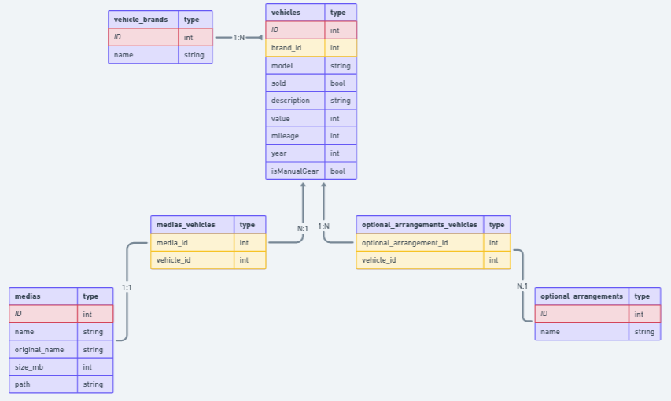

<h1 align="center">
  Bem Vindo ao CARZEL API
</h1>

  <p align="center">A progressive <a href="http://nodejs.org" target="_blank">Node.js</a> framework for building efficient and scalable server-side applications.</p>
  <p align="center">

## Description
<p>
  Este é o repositório da api do desafio técnico full stack para o Banco de Talentos da empresa Verzel.
</p>
<p>
  A api simula uma uma solução completa para uma empresa de revenda de veículos.
</p>

## Entidades
<p>
  A API possui uma estrutura simples para um `CRUD` de veículos e usuários administradores para adicionar novos veículos para a venda
</p>




## Installation

```bash
$ npm install
```

## Running the app

```bash
# development
$ npm run start

# watch mode
$ npm run start:dev

# production mode
$ npm run start:prod
```

## Test

```bash
# unit tests
$ npm run test

# e2e tests
$ npm run test:e2e

# test coverage
$ npm run test:cov
```

## Support

Nest is an MIT-licensed open source project. It can grow thanks to the sponsors and support by the amazing backers. If you'd like to join them, please [read more here](https://docs.nestjs.com/support).

## Stay in touch

- Author - [Kamil Myśliwiec](https://kamilmysliwiec.com)
- Website - [https://nestjs.com](https://nestjs.com/)
- Twitter - [@nestframework](https://twitter.com/nestframework)

## License

Nest is [MIT licensed](LICENSE).
